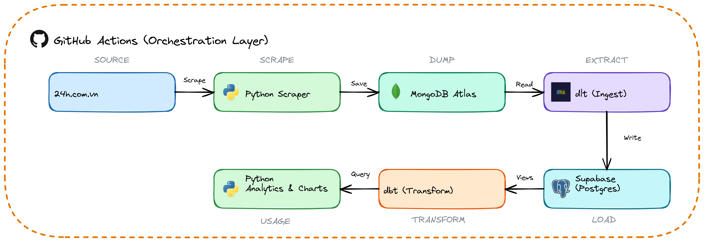
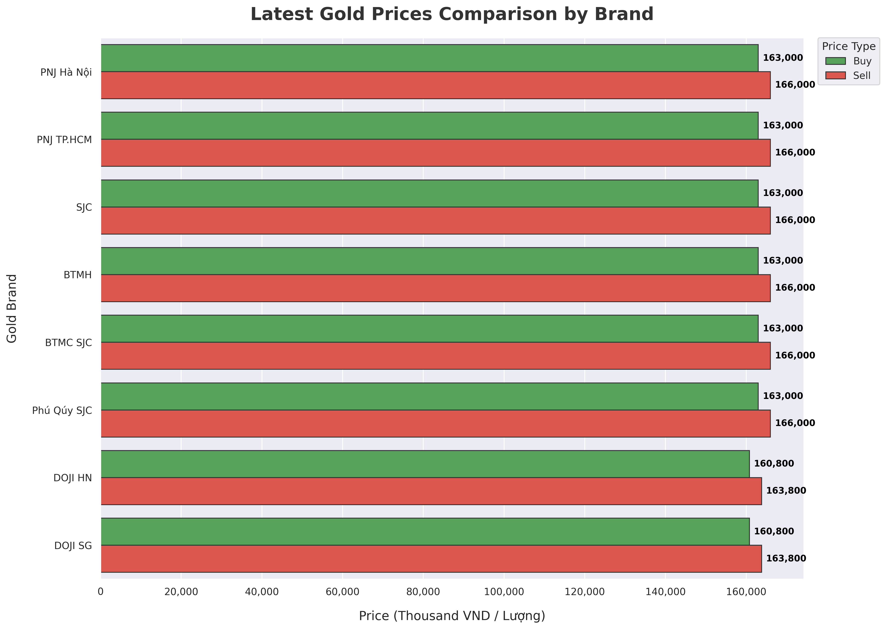
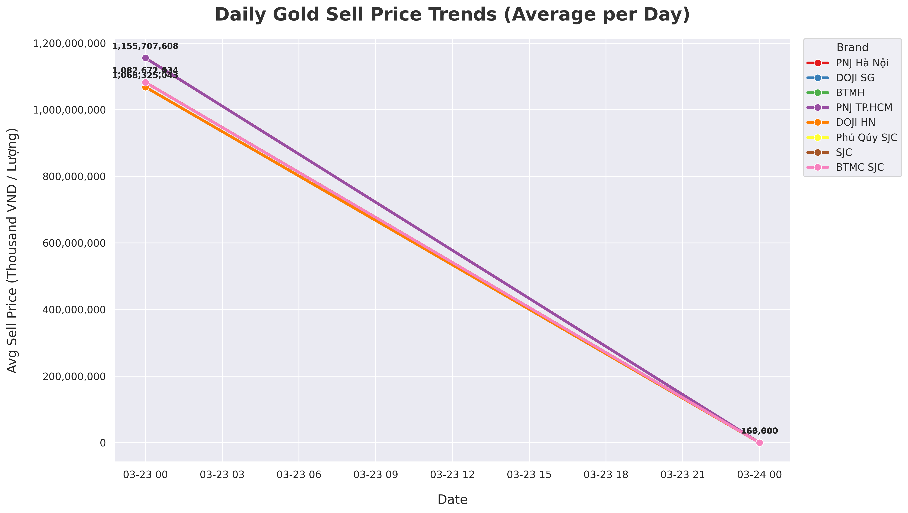
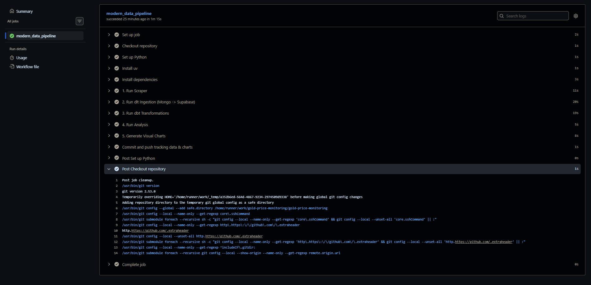
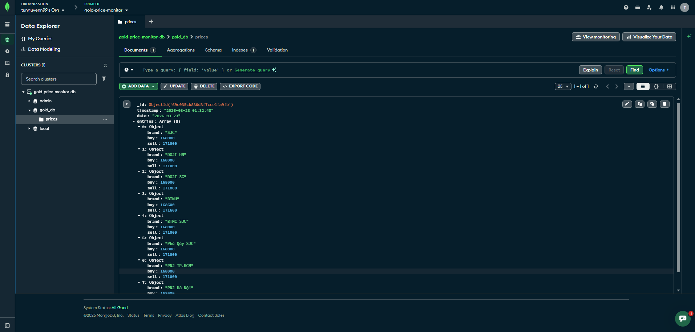
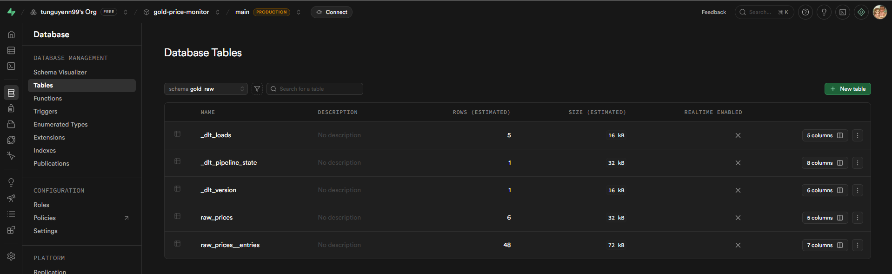

# 📈 Vietnam Gold Price Monitor — Modern Data Stack

A professional, end-to-end data pipeline for monitoring and analyzing gold price trends in Vietnam. This project implements a **Modern Data Stack (MDS)** architecture to scrape, ingest, transform, and visualize gold prices automatically every 2 hours.

---

## 🏗️ System Architecture

This project follows a linear, automated pipeline from raw data collection to final business intelligence:



---

## 💡 Why This Project?

The gold market in Vietnam is known for its **extreme volatility**. This project was built to **solve the monitoring challenge** by:

* 🤖 **Automation**: Running 24/7 on GitHub Actions without any manual intervention.
* ⏳ **Historical Accuracy**: Moving beyond "current price" to build a rich historical database in Supabase and MongoDB.
* 🧠 **Informed Decisions**: Providing clear, pre-calculated trend visualizations that highlight market shifts over time.
* 🚀 **Modern Data Stack**: Using industry-standard tools: `dlt`, `dbt`, and `Supabase`.

---

## 📊 Market Insights


*Latest gold prices by brand with automated data labels.*


*Daily average sell price trends across various brands.*

---

## 📸 Pipeline Execution Logs & Data

Here are snapshots showing the pipeline running successfully in production:

### Orchestration (GitHub Actions)


### Raw Storage (MongoDB Atlas)


### Data Warehouse (Supabase Postgres)


---

## 🛠️ Tech Stack Details

| Stage | Tool | Description |
| :--- | :--- | :--- |
| **Extraction** | `Python` | Scrapers using BeautifulSoup4 & Requests. |
| **Landing** | `MongoDB` | NoSQL storage for raw JSON responses (Audit trail). |
| **Ingestion** | `dlt` | Automated schema evolution & data loading. |
| **Warehouse** | `Supabase` | Managed PostgreSQL on the cloud. |
| **Transform** | `dbt` | Medallion architecture inside Supabase (Staging -> Marts). |
| **Visualization**| `Seaborn` | High-quality statistical charts with Matplotlib. |
| **Orchestrator** | `GH Actions` | Cron job scheduling & CI/CD. |

---

## 📁 Project Structure

```text
gold-price-monitoring/
├── .github/workflows/    # CI/CD Automation (GitHub Actions)
├── dbt_project/          # dbt Models, Seeds & Configs
├── images/               # Generated Analytics & Visualization Charts
├── excalidraw/           # Architecture diagrams and generators
├── sources/              # Core Python Processing Scripts
│   ├── scraper/          # Web Scraper Engine (scraper.py)
│   ├── dlt/              # Data Loading (dlt_ingestion.py & mongodb_pipeline.py)
│   ├── mongodb/          # MongoDB utilities and configuration
│   └── utils/            # Analytics and tools (analysis.py & visualize.py)
├── data/                 # Local Data Backups (CSV/JSON)
└── run_pipeline.sh       # Local Execution Entry point
```

---

## 🚀 Getting Started

### 1️⃣ Requirements
* Python 3.12+ & `uv` package manager.
* MongoDB Atlas & Supabase Accounts.

### 2️⃣ Quick Start
```bash
# Clone and Setup
git clone https://github.com/yourusername/gold-price-monitoring.git
cd gold-price-monitoring

# Create .env from template (Edit your credentials)
cp .env.example .env

# Run Full Pipeline
chmod +x run_pipeline.sh
./run_pipeline.sh
```

---

## 🛡️ Security & CI/CD

To ensure the **GitHub Actions** workflow runs successfully, you must add the following **GitHub Repository Secrets**. You can do this in two ways:

### Option 1: Manual (Recommended)
1. Go to your repository on GitHub.
2. Navigate to **Settings** > **Secrets and variables** > **Actions**.
3. Click **New repository secret** for each of the following:

| Secret Name | Description |
| :--- | :--- |
| `MONGO_URI` | MongoDB Atlas Connection String |
| `SUPABASE_DB_URL` | Full Postgres Connection URL (Transaction Pooler) |
| `SUPABASE_DB_PASSWORD` | Supabase Database Password |
| `SUPABASE_DB_HOST` | Supabase Host Address |
| `SUPABASE_DB_USER` | Supabase Username (postgres.xxxx) |
| `SUPABASE_DB_PORT` | Connection Port (6543) |

---

### Option 2: Automated (via GitHub CLI)
If your computer has the [GitHub CLI (`gh`)](https://cli.github.com/) installed, you can upload all secrets from your `.env` at once.

**1. Install `gh` (if missing):**
```bash
sudo apt update && sudo apt install gh -y
```

**2. Authenticate:**
```bash
gh auth login
```

**3. Upload Secrets:**
```bash
grep -v '^#' .env | xargs -I {} gh secret set {}
```

---

### 🤝 Connect & Community

* **Author**: [Tu Nguyen](https://www.linkedin.com/in/tunguyenn99/)
* **Community**: Join the [Xom Data](https://www.facebook.com/groups/xomdata/) community for more data analytics engineering insights!

*Built with ❤️ for the **Xom Data** community.*